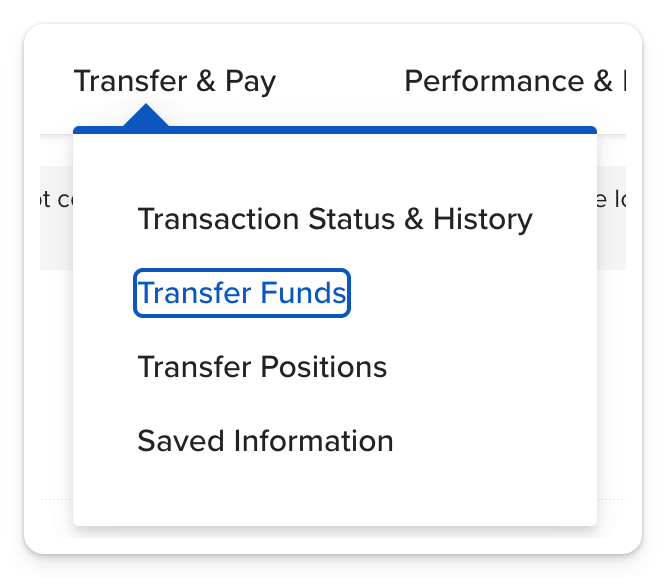
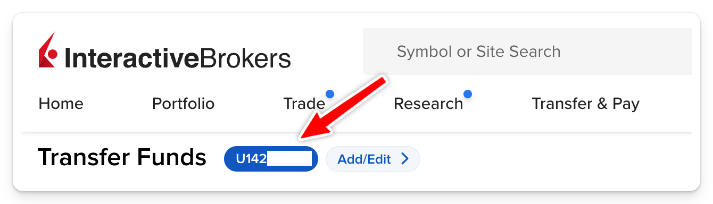
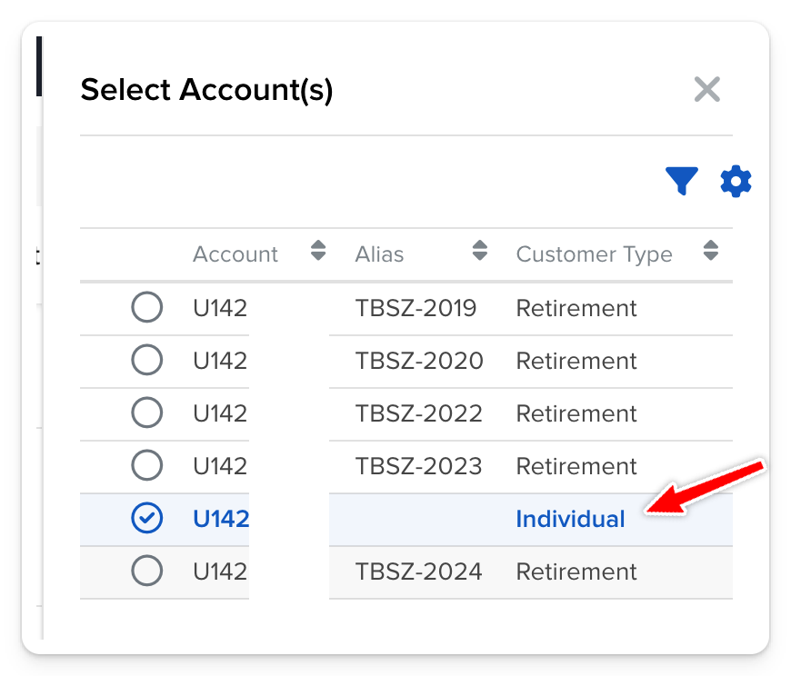
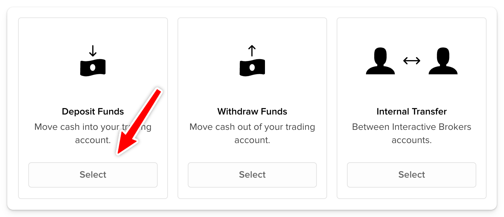
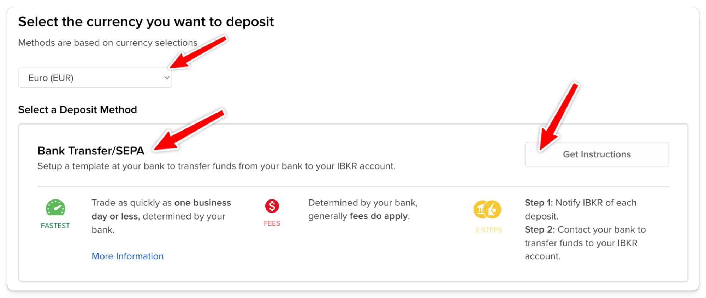
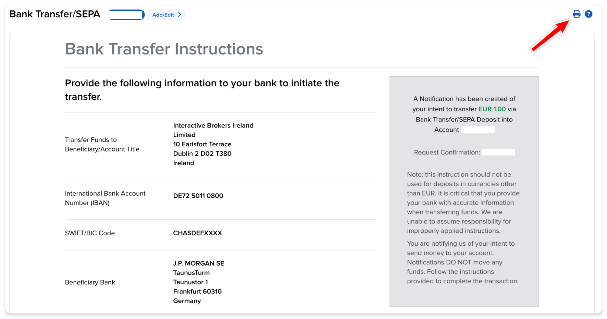

# IB deviza beutalási adatok

Kérdezd le az összes devizanemedhez az IB befogadó számlaszámot. Ehhez indítsd egy 1 EUR/USD/HUF-s beutalást

1. Transfer & Pay / Transfer Funds
	

2. Válaszd ki az Individual Account-ot a kék számlaválasztó gombon.
 

3. Deposit Funds

4. Use a new deposit method, majd válassz devizát, Bank Transfer/SEPA, Get Instructions

5. Save Bank Info: No, majd 1-1-1, végül Get Transfer Instructions

6. Ezeket csináld meg minden devizára és mind nyomtasd ki PDF-be. (mentsd el: deviza-EUR.pdf)

7. Ha ezzel mindegyik devizára megvagy, a Transfer & Pay / Transaction Status & History-ban Cancelold le az 1 EUR-s request-eket. Ezek egyébként 60 nap után maguktól is eltűnnek.
