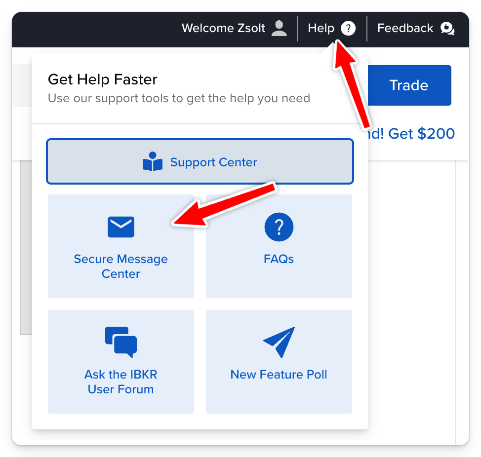

# IB befogadó adatok

Kérdezd meg az IB-t a fogadó adatokról.

1. 
2. 
3. 
4. 

5. Subject: TBSZ transzfer
   Body (lehet magyarul):

```
Jónapot kívánok,

TBSZ transzferhez szeretném elkérni az alábbi adatokat:

- Értékpapír számlaszám
- Fogadó szolgáltató KELER kód

Köszönettel,
<név>
```

    Account: Not account specific

6. Vársz 1-2 napot míg válaszolnak, addig lehet az Erste-s részt csinálni.
