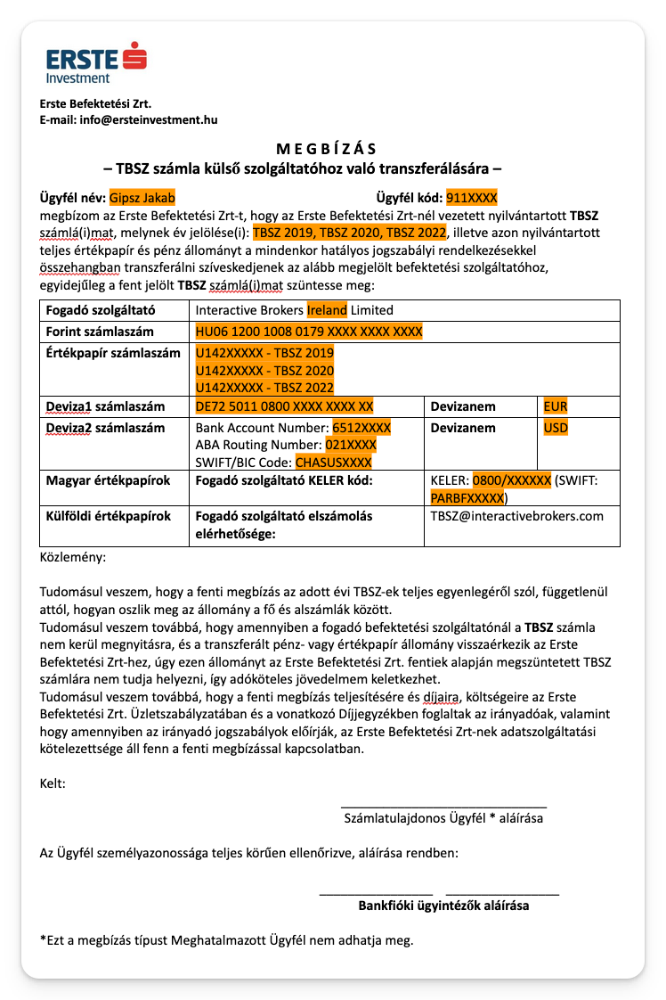
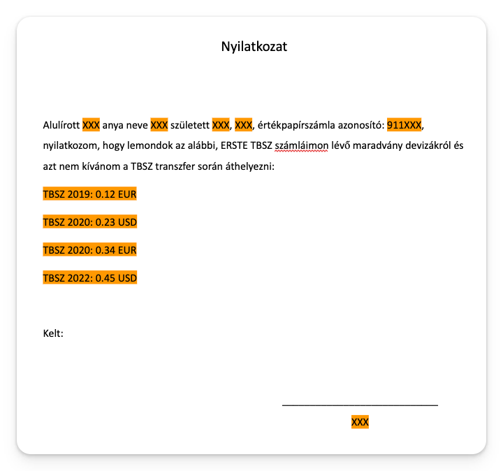

# Erste időpont foglalás és megbízási papír kitöltése

## Időpont foglalás

Először is, utalj be annyit az Erste számládra, hogy ne legyen rajta tartozás.

Foglalj időpontot egy Erste fiókba az alábbi linken:

[Foglalj online időpontot bankfiókjainkba!](https://www.erstebank.hu/hu/ebh-nyito/mindennapi-penzugyek/elektronikus-szolgaltatasok/online-fioki-idopontfoglalas)

Javaslom hogy komolyabb fiókba, ne plázába foglalj. Legalább 5 nappal a deviza váltás utánra foglalj, hogy biztos ne maradjon semmi elszámolás alatt.

## Erste megbízás kitöltése

Töltsd ki ezt a sablont, és mentsd le megbizas.pdf néven: [Erste megbizas.docx](sablonok/Erste%20megbizas.docx)

Kb. így néz ki:

Töltsd ki ezen kívül még ezt, hogy lemondasz a maradvány devizákról (0.29 EUR, stb.): [Erste maradvány.docx](sablonok/Erste%20maradvány.docx). Mentsd le maradvany.pdf néven.

