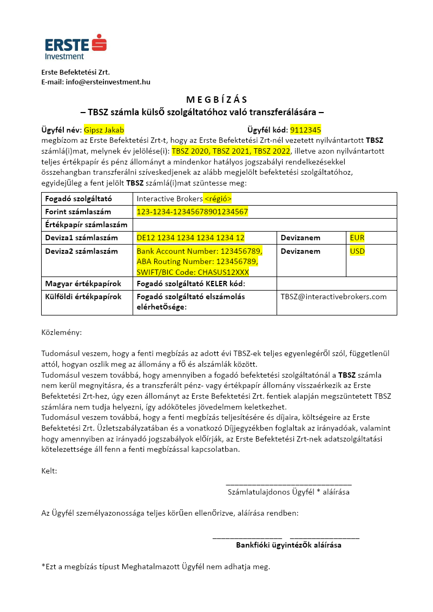

# Erste időpont foglalás és megbízási papír kitöltése

## Időpont foglalás

Először is, utalj be annyit az Erste számládra, hogy ne legyen rajta tartozás.

Foglalj időpontot egy Erste fiókba az alábbi linken:

[Foglalj online időpontot bankfiókjainkba!](https://www.google.com/url?q=https://www.erstebank.hu/hu/ebh-nyito/mindennapi-penzugyek/elektronikus-szolgaltatasok/online-fioki-idopontfoglalas&sa=D&source=editors&ust=1709227075639501&usg=AOvVaw1tLqJRGUJokb6R4RU_Smc-)

Javaslom hogy komolyabb fiókba, ne plázába foglalj. Legalább 5 nappal a deviza váltás utánra foglalj, hogy biztos ne maradjon semmi elszámolás alatt.

## Erste transzfer papír kitöltése

Másold le az alábbi Google Docs file-t (File / Make a copy) és a saját változatodban írd át a sárga részeket (és töröld ki a sárgát).[ERSTE TBSZ transzfer megbízás sablon](https://www.google.com/url?q=https://docs.google.com/document/d/1OThmCSp6udeJSvd9Q8B2-LzXfvJmT1ioNiMh6evRnwE/edit?usp%3Dsharing&sa=D&source=editors&ust=1709227075640348&usg=AOvVaw1U2Ph4fzGv6n7ugk5us5nn)

Kb. így néz ki:

Mentsd le megbizas.pdf néven

Töltsd ki ezen kívül, töltsd ki ezt, hogy lemondasz a maradvány devizákról (0.29 EUR, stb.)

[Nyilatkozat apró lemondás sablon](https://www.google.com/url?q=https://docs.google.com/document/d/1tNPBAoB8rynWXGZvtz-T4eRPXTMh1Lbxu6nhz_Kd5DI/edit?usp%3Ddrive_link&sa=D&source=editors&ust=1709227075641167&usg=AOvVaw1eL0rypWYOAf7uo4o6WZgC)

Mentsd le maradvany.pdf néven.
