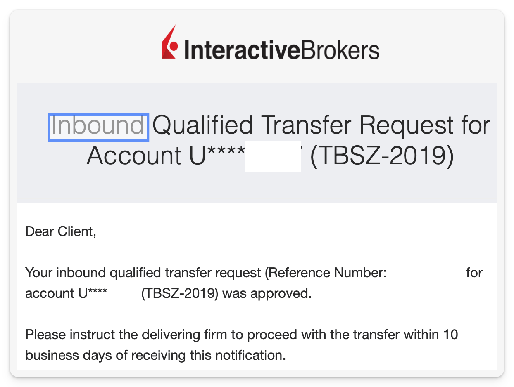

Fiók után elindul a folyamat, amely kb. 1 hónapig fog tartani.
Nekem az alábbiak szerint alakult:

**1\. nap**: Fiókban aláírás

**2\. nap**: Telefonon hívnak hogy biztos-e, nem akarok-e egyéni szerződést. Nem akartam. Ismét hívnak hogy aláíró kartont elfelejtettünk csinálni.

**5\. nap**: Visszamegyek aláíró kartont csinálni.

**14\. nap**: IB küld egy ilyen emailt, nem kell vele semmit csinálni.

**15\. nap**: IB küld egy emailt NAV bejelentésről, lásd köv. fejezet.  
Megjelennek az IB számlámon az értékpapírok. Devizák még sehol.

**17\. nap**: Erste küld egy PDF-t az értékpapír tranzakciókról.

**19\. nap**: HUF megérkezik IB-hez, küld róla 2 emailt:

valamint ha nem maradt már más, akkor egy ilyet:

**22\. nap**: USD megérkezik IB-hez. Erről is jön 2 ugyanolyan email.

Ez után az Erste már nem engedett belépni online, a számlát lezárták.
