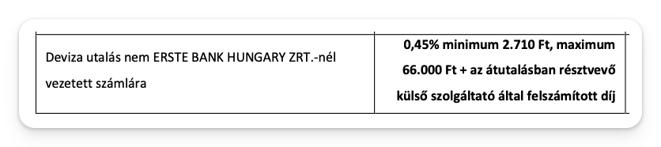

# Interactive Brokers TBSZ leírás / guide

*Ha valami nem helyes vagy kiegészítenéd valamivel nyiss itt egy Issue-t.*

[1. Interactive Brokers TBSZ számlanyitás](1.%20Interactive%20Brokers%20TBSZ%20számlanyitás.md)

[2_kettos_adoztatas](2_kettos_adoztatas.md)

[3_befogado_nyilatkozat](3_befogado_nyilatkozat.md)

## IB befogadó adatok

Kérdezd meg az IB-t a fogadó adatokról.

Subject: TBSZ transzfer

Body (lehet magyarul):

Jónapot kívánok,

TBSZ transzferhez szeretném elkérni az alábbi adatokat:

\- Értékpapír számlaszám

\- Fogadó szolgáltató KELER kód

Köszönettel,

<név>

Account: Not account specific

Vársz 1-2 napot míg válaszolnak, addig lehet az Erste-s részt csinálni.

## Erste deviza átváltások

Váltsd át a devizáidat úgy, hogy minden TBSZ alszámlán csak 1 devizád legyen, mert devizánként kell fizetni átutalási minimum díjat.

Alapszabály, hogy ha 920 EUR / 1000 USD felett van egy devizából akkor azt megéri megtartani, alatta megéri HUF-ra váltani. (Ez úgy jön ki, hogy 0.75%-on vált devizát az Erste, így ezek felett több lenne a váltási díj a minimum díjnál).

A díjjegyzék ide vonatkozó része 2024 februárban így nézett ki:

Erste-n ezt a Deviza Ügyletek alatt találod, nem a Devizaváltás alatt (logikus 🙃).

Ez után 3-4 nap szükséges ameddig a váltott devizák “Elszámolás alatti tételek”-nél 0-k lesznek. Ezt meg kell várnod a transzfer indítása előtt.

## Erste időpontfoglalás

Foglalj időpontot egy Erste fiókba az alábbi linken:

[Foglalj online időpontot bankfiókjainkba!](https://www.google.com/url?q=https://www.erstebank.hu/hu/ebh-nyito/mindennapi-penzugyek/elektronikus-szolgaltatasok/online-fioki-idopontfoglalas&sa=D&source=editors&ust=1709227075639501&usg=AOvVaw1tLqJRGUJokb6R4RU_Smc-)

Javaslom hogy olyan fióban foglalj ahol van pénztár is, plázákban sokszor nincs. Legalább 5 nappal a deviza váltás utánra foglalj, hogy biztos ne maradjon semmi elszámolás alatt.

##
ERSTE transzfer papír kitöltése

Másold le az alábbi Google Docs file-t (File / Make a copy) és a saját változatodban írd át a sárga részeket (és töröld ki a sárgát).[ERSTE TBSZ transzfer megbízás sablon](https://www.google.com/url?q=https://docs.google.com/document/d/1OThmCSp6udeJSvd9Q8B2-LzXfvJmT1ioNiMh6evRnwE/edit?usp%3Dsharing&sa=D&source=editors&ust=1709227075640348&usg=AOvVaw1U2Ph4fzGv6n7ugk5us5nn)

Kb. így néz ki:

Mentsd le megbizas.pdf néven

Töltsd ki ezen kívül, töltsd ki ezt, hogy lemondasz a maradvány devizákról (0.29 EUR, stb.)

[Nyilatkozat apró lemondás sablon](https://www.google.com/url?q=https://docs.google.com/document/d/1tNPBAoB8rynWXGZvtz-T4eRPXTMh1Lbxu6nhz_Kd5DI/edit?usp%3Ddrive_link&sa=D&source=editors&ust=1709227075641167&usg=AOvVaw1eL0rypWYOAf7uo4o6WZgC)

Mentsd le maradvany.pdf néven.

## ERSTE fiók

Nyomtass ki mindent:

\- befogado-XXXX.pdf

\- deviza-XXX.pdf

\- egyenlegkozlo.pdf

\- maradvany.pdf

\- megbizas.pdf

\- szamlakivonat.pdf

Ha gondolod, a deviza-XXX.pdf papírokon tollal húzd át a U… számot, hogy ne keveredjenek össze.

Ezek után mehet az ERSTE fiók, laptopot jó ötlet vinni magaddal.

TODO

Egyenlegkozlo

Fill out fix
