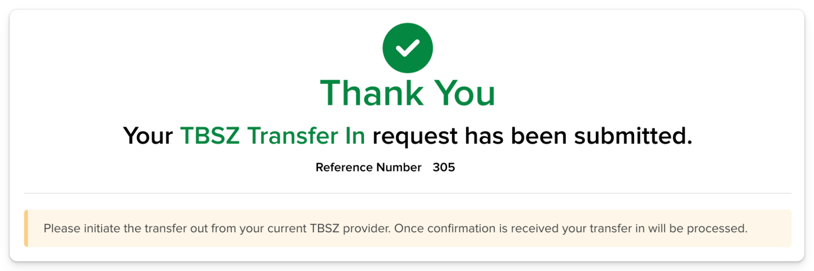
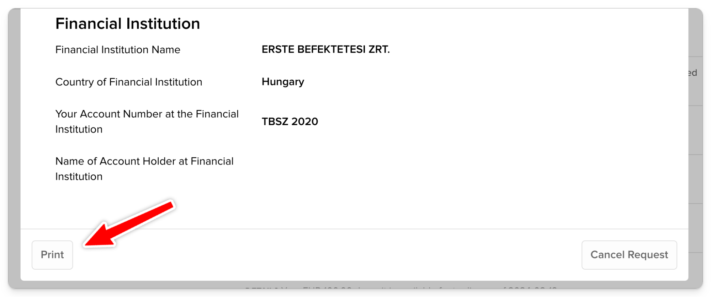

# Befogadó nyilatkozatok

_Nagyságrendileg a teljes transzfer kb. 1 hónapig fog tartani, van akinek több, van akinek 2 hét._

## Erste-n

1. Legfontosabb az **ügyfélkód**. Ezt a jobb felső sarokban láthatod, illetve a havi számlakivonaton.

2. Javaslom letölteni az utolsó **számlakivonat** PDF-et az Információ / Archív dokumentumok menü alól. A kezdő dátumot át kell írni hogy megjelenjen valami. (mentsd el: szamlakivonat.pdf)

3. Ezen kívük nyomtasd még ki PDF-be az "**Egyenlegközlő**"-t baloldalon. (egyenlegkozlo.pdf), valamint az egyenlegközlő alatt menj be a "**Készletinformációk**" fülbe, és ott egyenként minden alszámlára nyomtasd ki a táblázatot. (keszlet-2020.pdf). Bekerülési árat csak így lehet kimenteni.

## IB-n

1. IBKR-ben Transfer & Pay / Transfer Funds. Kattints a kék gombra, majd válaszd ki az egyik TBSZ alszámlát.
   

2. Töltsd ki így. Fontos hogy az Erste Befektetési Zrt.-t válaszd, és ne a bankot.
   

3. Ezt csináld meg az összes TBSZ alszámlára. Előzőleg letöltött egyenlegközlő PDF ebben segít. Next és Done.
   

4. IBKR befogadó nyilatkozatok letöltése.
   Transfer & Pay / Transaction Status & History fül alatt kattints rá a Full Transfer - Acknowledged-ekre és egyenként nyomtasd ki őket PDF-be. (mentsd el: befogado-2020.pdf)
   
   

Ha végeztél, minden TBSZ alszámlához lesz egy PDF-ed.
