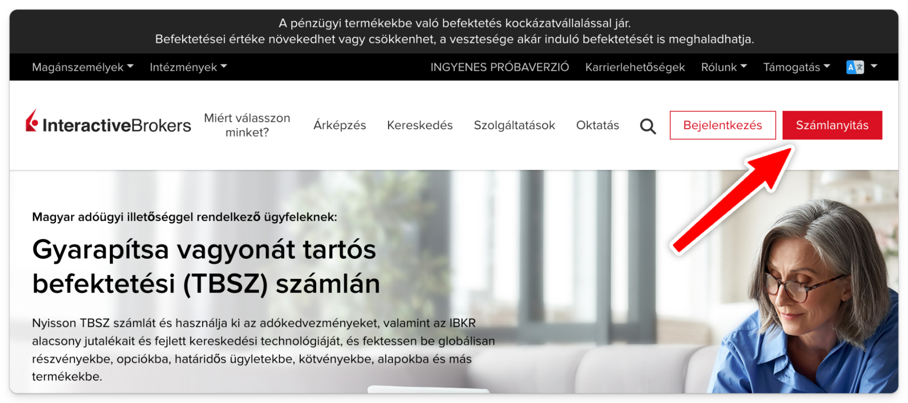
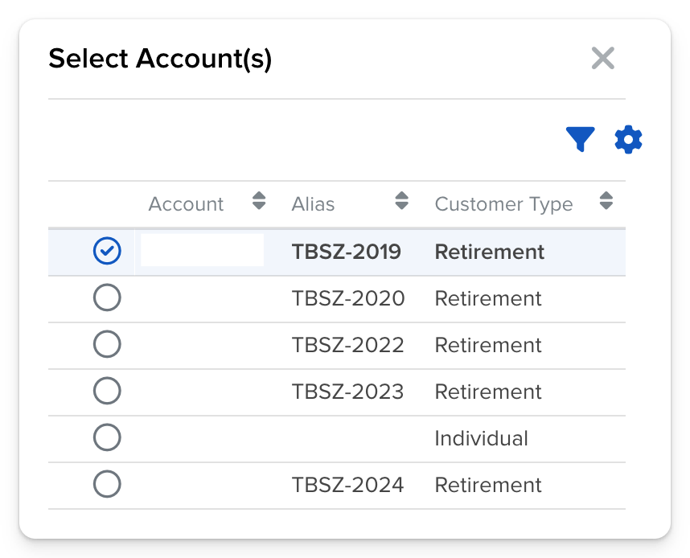

# Interactive Brokers TBSZ számlanyitás

1. A hivatalos oldalon kattints a Számlanyitásra: [interactivebrokers.hu](https://www.interactivebrokers.hu/hu/home.php) Angol, Ír, végű oldal mind ugyanoda visz, igazából mindegy melyikre mész.

   Ha nem tudod mi a Margin trading, javaslom a Cash account-ot, egyszerűbb, nincs kérdőív, biztonságosabb. Én EUR-t választottam Base Currency-nek, de választhatsz mást is.

   A weblapjuk egyébként elérhető magyarul, ha az ügyfélszolgálatnak írsz, ők is magyarul válaszolnak, de a kereskedési felület angol.

   

2. Tedd fel az IBKR mobil appot és kösd össze, hogy ne SMS-ben kapj kódot minden belépéskor. Majdnem minden account lopás SMS-en keresztül megy - a mobil app-os belépés sokkal biztonságosabb.

3. Olvasd el az alábbi dokumentumot a TBSZ-ről: [https://ibkr.info/node/4888](https://ibkr.info/node/4888)

4. Nyiss meg minden létező régi TBSZ évhez egy TBSZ alszámlát. Előző linken le van írva hogy kell.

   Ha kész vagy kb. így kell kinéznie (a kék gombra kattintva a következő képen). Van egy Individual accountod + sok TBSZ a régi és új éveknek. Mindegy hány TBSZ-ed van, a havi díj nem változik.

   

5. Fizess be valamennyi pénzt az Individual számládra. Van rá 45 napod.

   Transfer & Pay / Transfer Funds. Kattints a kék gombra, a fenti ábra fogad.

   

   Itt válaszd ki az Individual account-t, majd Deposit Funds. Nincs minimum megkötve, csak valamennyi pénznek be kell érkeznie.
