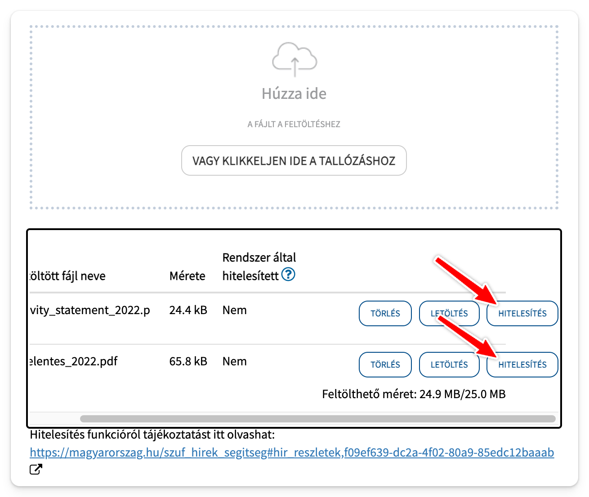

# NAV jelentés

A sikeres transzfer után az IB fog küldeni egy ilyen emailt, minden egyes TBSZ alszámlához:


Ennek a sablonnak van egy kitölthető változata, itt elérhető: [IB_TBSZ_agreement_editable.pdf](../sablonok/IB_TBSZ_agreement_editable.pdf) (köszönjük RoBos-nak a PH-ról hogy kitölthetővé tette).

A kitöltésén egy bonyolult dolog van, az **Elhelyezett pénzösszeg: / Deposited amount**.
Ez az Activity Statement-ből derül ki.
(Az aláírásnál ne zavarjon a nyomtatott betű, majd később hitelesítve lesz.)


## Activity Statement

1. IB-n Performance and Reports / Statements.
2. Fent kék account választóval válaszd ki az egyik TBSZ alszámládat, más ne legyen be x-elve, csak egyetlen számla!
3. Kattints az Activity gombra
   
4. Period: Year to Date és PDF letöltés
   
5. A file-t mentsd el, mondjuk "Activity Statement 2019.pdf" néven. Később majd be kell küldened a NAV-nak.
6. A dátumot és az összeget megtalálod a **Transfers** résznél. Itt a "Total in HUF" összegeket **össze kell adnod**, és ezt kell majd beírnod.
   
7. Dátumhoz én a legkésőbbi dátumot írtam be, szintén innen.

Ezek alapján töltsd ki a PDF-et.

## Bejelentés

Bejelenteni az [epapir.gov.hu](https://epapir.gov.hu/) felületen lehet.

Témacsoport: Adóügy (NAV)  
Ügytípus: Kérelem (Adóügy)  
Címzett: NAV xxx Vármegyei Adó- és Vámigazgatósága ([itt egy térképes kereső](https://nav.gov.hu/igazgatosagok/igazgatosagok/igazgatosag-kereso))  
Hivatkozási szám: hagyd üresen  
Előzmény iktatószáma: 1111111111 (10 db szám, bármi)  
Tárgy: Külföldi szolgáltatónál nyitott TBSZ bejelentése

szövegnek pl:

```none
Tisztelt Nemzeti Adó- és Vámhivatal!

A mellékelt dokumentum alapján bejelentem az Interactive Brokers Ireland Limited (székhely: 1 D01 H7V7 Dublin, North Wall Quay 91/92, North Dock One, Írország) szolgáltatónál xxxxxxx azonosító alatt vezetett értékpapírszámlámat.

Kérem a fenti bejelentésem elfogadásának visszaigazolását.

Üdvözlettel,
xxx
```

Ami fontos:

- minden egyes TBSZ alszámlához külön bejelentés kell
- minden bejelentésben legyen:
  - szöveg
  - sablon kitöltve PDF (hitelesítve)
  - activity statement PDF (hitelesítve)
- a csatolmányokat hitelesítsd majd a feltöltési felületen, mindegyikhez rá kell kattintani a hitelesítés gombra külön



## NAV válasza

Nekem másnap érkezett egy visszaigazoló levél a tárhelyre, miszerint:

> A személyi jövedelemadóról szóló 1995. évi CXVII. törvény 67/B. § (8) bekezdése szerinti bejelentését – melyet külföldi szolgáltatóval kötött új tartós befektetési számla nyitásáról tett – tudomásul vettem, további adatok megküldésére nincs szükség.

## A jövőben

Ezt egyébként minden, a jövőben nyitott TBSZ alszámlánál meg kell majd tenni, amint beutalsz rá legalább 25000 Ft-nyi devizát.
