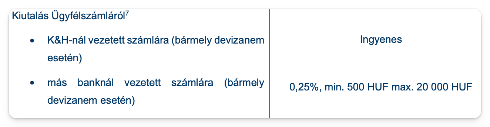

# K&H kiegészítés

Alapvetően kövesd az Erste-s leírást, ezekkel a különbségekkel

1. Belépés majd Fiókom / Kivonatok / Havi kivonatok, mentsd el az utolsó havi számlakivonatot alul

   

2. Fiókom / Személyes adatoknál mentsd el a neved mellett található ügyfélszámot, nekem 388-al kezdődik.
3. Az ERSTE-s részről töltsd ki a Befogadó nyilatkozatok részt, a Ceding Customer ID-hez írd be az előbb elmentett ügyfélszámodat.

   

4. Nyomtasd ki a befogadó nyilatkozatokat alszámlánként és a deviza beutalási adatokat egy-egy PDF-be, ugyanúgy ahogy az Erste-s résznél van.
5. Deviza konverziónál K&H 1%-on vált, így számold át hogy megéri-e átváltani és egy devizát utalni, vagy inkább külön-külön. \
   Kb. 200e Ft felett megéri több devizaként küldeni, alatta átváltani.

Deviza transfer díjak (számlánként - devizánként)



Értékpapír transzfer díjak


## K&H felmondási dokumentumok

Két dokumentumra lesz szükséged, [erről az oldalról](https://www.khertekpapir.hu/ugyfeltamogatas/dokumentumok?dm=33)

1. "Alapmegállapodás és kapcsolódó szerződések felmondása"
2. "Kimenő értékpapír transzfer megbízás"

Az Alapmegállapodás kitöltése egyértelmű, a Kimenő értékpapír transzfer megbízásnál töltsd ki egy új papírt minden egyes alszámlához - TBSZ évhez.

Így kell kitölteni:

```
Fogadó intézmény megnevezése: Interactive Brokers Ireland Limited
Kapcsolattartó: TBSZ Transfer Group
E-mail cím: tbsz@interactivebrokers.com
Számlaszám a fogadó intézménynél: U...(alszámlaszám) - TBSZ 2020
Átadás oka: transzfer
```


4. Töltsd ki és küldd el ide: info@khertekpapir.hu az emailhez mellékeld:
   - Alapmegállapodás felmondása papír
   - Kimenő értékpapír transzfer papír, TBSZ évenként külön kitöltve
   - Deviza beutalási adatok, devizánként külön
